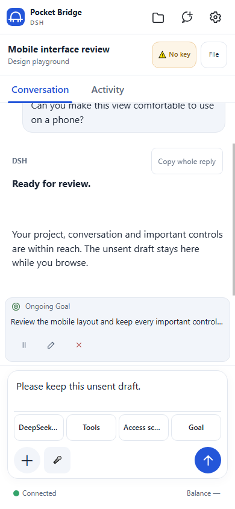

# Pocket Bridge


A lightweight, unofficial phone interface for **DeepSeek Harness (DSH) running on your own Windows computer**. Open a browser on your phone to work with local projects and conversations, send instructions, respond to supported approvals, and transfer workspace files. Your computer runs DSH; Pocket Bridge provides the connection and a small browser interface.

## Try the Windows preview

**Already using DSH on Windows? Continue a conversation from your phone browser without installing a phone app.**

[Download Windows x64 preview.12 (about 39 MB)](https://github.com/jyb114/pocket-bridge/releases/download/v1.0.0-preview.12/PocketBridge-1.0.0-preview.12-win-x64-Setup.exe) · [Release notes](https://github.com/jyb114/pocket-bridge/releases/tag/v1.0.0-preview.12) · [Checksums](https://github.com/jyb114/pocket-bridge/releases/download/v1.0.0-preview.12/SHA256SUMS.txt)

1. **Check DSH first:** it must be installed, signed in, and able to reply on your Windows computer.
2. **Install and connect:** install Pocket Bridge, open its local console, and copy the complete HTTPS phone link. Keep the link and its keys private.
3. **Try one conversation:** open the link in your phone browser, select a project, and send a harmless test message. Keep the computer awake and online.

**Preview scope:** current releases support DSH only. Runtime capabilities vary by version. Physical iPhone/Android, cellular use, and some file-save flows still need independent validation; see the [acceptance record](docs/DSH-MOBILE-ACCEPTANCE.md). DSH and model-provider costs are separate. Read the [transport and privacy limits](#privacy-and-transport) before exposing a workspace.



*Interface preview with synthetic content, not a recording of a live account or evidence of physical-phone acceptance.*

Trying it on a real phone? Follow the [first-use checklist](docs/FIRST-USE-PILOT.md) and share a redacted result through [GitHub Issues](https://github.com/jyb114/pocket-bridge/issues). Please do not post a complete connection link, access key, or private conversation.

**New releases focus exclusively on DSH.** Codex and Dot are retired from the new gateway and Windows installer. Previous combined releases and their installers remain available in [GitHub Releases](https://github.com/jyb114/pocket-bridge/releases), with no further integration updates. Upgrading preserves the installation directory, connection keys, device records, uploads, and existing local journals. It does not close Codex, delete its conversations, or remove your target applications.

Pocket Bridge is independent and unofficial. It is not affiliated with or endorsed by DeepSeek, OpenAI, or Cloudflare. DSH, model access, and any provider fees are separate. See [third-party notices](THIRD-PARTY-NOTICES.md).

Other community phone clients and plugins exist, including [DSH Mobile Remote](https://github.com/april-jk/dsh-mobile-plugin). Pocket Bridge is an independent option focused on a small browser interface, a Windows installer, explicit image loading, protected content transport and exact-version compatibility reporting. It does not claim to be an official or exclusive DSH mobile product. Consult each project's own platform, protocol and security requirements before choosing it.

## What it does

- Browse projects on the computer, add an existing directory, and create conversations.
- Send messages and view streamed replies, exposed reasoning, tool activity, and queued messages.
- Select models and tool presets reported by the connected runtime. Check supported permission presets through a readback instead of assuming a command succeeded.
- Handle approvals, choices, and questions when the runtime exposes that capability.
- Upload attachments and browse, preview, or download permitted workspace files. Images load only when requested. Supported image references use the runtime's session-authorized attachment reader. A newly uploaded generic image also has a bounded, temporary preview on this page; it is cleared when the connection or conversation changes. Attachments without either source remain explicitly unavailable.
- View supported goals, plan controls, balance information, and an explicitly requested desktop screenshot.
- Use an encrypted local connection or an optional temporary Cloudflare tunnel. No phone app is required.

Capabilities depend on the installed DSH runtime, its plugins, and the connected account. This is a purpose-built mobile interface, not a complete reproduction of every desktop plugin. Unsupported operations must be explained or unavailable rather than presented as working buttons. Read the [compatibility matrix](docs/DSH-COMPATIBILITY.md) and [manual acceptance record](docs/DSH-MOBILE-ACCEPTANCE.md).

## Windows setup

1. Install and sign in to DSH on the computer. Verify that it can open a project and reply locally.
2. Download a DSH-only Windows setup from [Releases](https://github.com/jyb114/pocket-bridge/releases). Older combined installers are historical releases.
3. Install Pocket Bridge. An upgrade uses the saved installation location; choose a D: location for a new install if preferred.
4. Open the desktop console and verify that the detected DSH runtime is running. The console remains local to the computer.
5. Copy the complete HTTPS phone connection link. Keep its access key and `#k=` fragment private.
6. Open the link on the phone. Select a project and conversation, or add a computer folder and create one. The host computer must remain awake and connected.

The Windows installer bundles Node.js and cloudflared with their license texts. It does not bundle DSH. Temporary tunnel addresses can change after a restart; use the newly copied link when that happens. A tunnel that is unavailable or disconnected does not mean a message was accepted. Do not repeatedly send an instruction with an uncertain delivery result.

Phone content requires browser WebCrypto in a secure context. Use the HTTPS tunnel, or a local HTTPS entry whose certificate your phone trusts. Ordinary LAN HTTP does not provide this context and is not a supported plaintext fallback. The local console provides HTTPS setup guidance; certificate trust must be configured separately.

## Source setup

Source users need Node.js 24 or newer. For an internet tunnel, install cloudflared separately or use the official distribution expected by the local configuration. Then run:

```powershell
node scripts/gateway-daemon.js
```

The desktop launcher and local console report the actual listener address; the gateway avoids claiming another application's occupied port. Runtime configuration and generated keys are local files excluded from this repository. Do not copy another person's configuration, access links, logs, or notification credentials into a public checkout.

DSH's official npm entry point is `npx @deepseek-ai/dsh web`. Historical npm tests cover specific versions and flows, not a promise that every old or future build is fully compatible. DSH remains a rapidly changing developer preview. See the exact test limits in the [matrix](docs/DSH-COMPATIBILITY.md) and the [official project](https://github.com/deepseek-ai/deepseek-harness).

## Privacy and transport

The supported phone content channels use authenticated encrypted requests and responses, including messages and protected workspace transfers. A passive tunnel relay receives ciphertext for those channels. It still sees traffic metadata and serves the initial web application; a relay that actively substitutes that application is outside this protection. The model provider necessarily receives the instructions submitted to it by DSH.

The raw original DSH web interface is not exposed as a remote alternative in new releases. Open the original interface locally on the computer when needed. Encryption failures, missing keys, expired authorization, and unsupported capabilities must be reported without falling back to plaintext remote content.

An optional [private Tailscale HTTPS entrance](docs/TAILSCALE-PRIVATE-HTTPS.md) can avoid serving the initial application through Cloudflare. It is disabled by default, preserves the bridge's device and encryption checks, and does not install or configure a VPN. Real phone enrollment and connectivity must be verified after the owner sets it up. The phone's Settings → Connection and compatibility panel shows the observed runtime and implemented interface coverage separately from release acceptance.

Local DSH history, uploads, configuration, and browser drafts have separate storage boundaries. Do not assume that every file on the computer or phone is encrypted at rest. Optional notification services are separate external recipients. No personal notification script or account is included. See [SECURITY.md](SECURITY.md) for the precise scope.

## Mobile design

Pocket Bridge uses its own bridge mark and a shared set of simple controls. A compact top bar gives phone conversations the full screen width. Secondary actions live in a labelled menu; model, tool, permission, and goal controls remain visible without a hidden horizontal toolbar. Primary touch actions have at least a 44-pixel target. The interface uses system fonts and local assets, with light and dark palettes and Chinese, English, and Spanish text.

History is paged, unchanged message rows are reused, streaming updates are coalesced, and images are requested explicitly. These reduce work without removing content, authentication, or encryption. Network speed, tunnel stability, runtime discovery, and the amount of history can still affect response time.

Public page assets have a bounded compression cache, with current source bytes and file identity checked on every request. This reduces repeated server work without changing compression settings or caching private conversation/file responses; first-miss compression is unchanged. Concurrent modern-session queue, goal and model reads share only an in-flight request, with a one-second join window and fresh reads after mutations or connection changes. Repeated catalog updates preserve unchanged navigation buttons instead of recreating them. These optimizations retain the existing feature and security boundaries rather than omitting content.

## Development and verification

```powershell
npm run ci
npm run audit
npm run scan:strict
```

The isolated suite covers the DSH/shared gateway, encryption, authorization, file scope, UI behavior, lifecycle, payload closure, and upgrade retention. It does not substitute for operating a real runtime or a physical phone. Live checks are recorded separately, with the runtime version, transport, observed result, and untested boundaries.

Public product documentation is in English. User-facing mobile translations remain available. Report reproducible bugs through [GitHub Issues](https://github.com/jyb114/pocket-bridge/issues); keep credentials, complete connection URLs, and private transcripts out of public reports. See [SECURITY.md](SECURITY.md) for sensitive reports.

Pocket Bridge's own code and original artwork are under the [MIT license](LICENSE).
